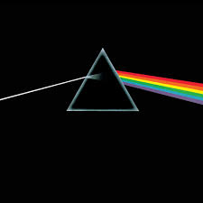
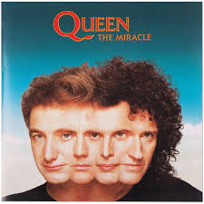
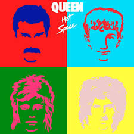
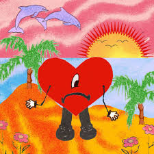
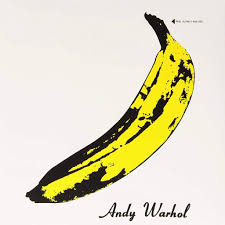
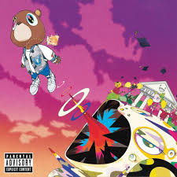
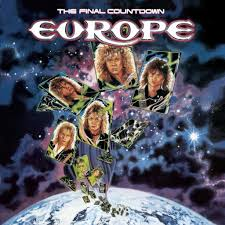

<!DOCTYPE html>
<html lang="en">
<head>
    <meta charset="UTF-8">
    <meta name="viewport" content="width=device-width, initial-scale=1.0">
    <title>Echo Blue Music</title>
    <link rel="stylesheet" href="style.css">
    <!--Fonts-->
    <link href="https://fonts.googleapis.com/css2?family=Uto&display=swap" rel="stylesheet">
    <link href="https://fonts.googleapis.com/css2?family=Comic+Sans+MS&family=Dancing+Script&family=Montserrat&family=Abril+Fatface&family=Quicksand&family=Pacifico&family=Anton&family=Exo&family=Roboto+Slab&family=Cinzel&family=Amatic+SC&display=swap" rel="stylesheet">

</head>

<body>
    
Loading Music Magic...

    <!--Main Page-->
    <section class="main-body">
        

            <audio id="music-player" preload="auto">
                <source src="./mp3/never-gonna-give-u-up.mp3" type="audio/mp3"> <!-- Ensure the correct path -->
                Your browser does not support the audio element.
            </audio>
            <!-- Top Row of Animated Album Covers (Right to Left) -->
            

                    
                    
                    
                    
                    
                    
                    
                    
                    
                    

                
                
                
                
                
                
                
                
                
                
                
                
                

                <!--additional-->
                
                
                
                
                
                
                
                
                
                
                <!-- Duplicate the covers for seamless looping -->
                
                
                
                
                
                
                
                
                
                
                
                
                
                
                
                
            

            <!-- Bottom Row of Animated Album Covers (Left to Right) -->
            

                
                
                
                
                
                
                
                
                
                
                <!-- Duplicate the covers for seamless looping -->
                
                
                
                
                
                
                
                
                
                
                
                
                

                <!--additional-->
                
                    
                    
                    
                    
                    
                    
                    
                    
                    

                
                
                
                
                
                
                
                
                
                
                
                
                
                
            

            <!-- Title, Text, Button -->
            

                <h1>Echo Blue Music</h1>
                
Where Music Never Stops. Listen To All The Hot Music Right Now.

                <button class="bottom-right-button" onclick="playSong()">Listen Now</button>
            

        

        <!--Divider-->
        

            

                <!-- Carousel Section (Now takes up the entire divider) -->
                

                    <!-- Left Arrow Button -->
                    <button class="arrow-left" onclick="moveCarousel('left')">←</button>
                <!-- Carousel (Single Row of Cards) -->

    

        
        
Bad Bunny

    

    

        
        
Beyoncé

    

    

        
        
Taylor Swift

    

    

        
        
Morgan Wallen

    

    

        
        
Sabrina Carpenter

    

    

        
        
Echo Blue Music

    

    

        
        
Kanye

    

    

        
        
Travis Scott

    

    

        
        
Luke Combs

    

    

        
        
Prince

    

    

        
        
Lady Gaga

    

                
        
                    <!-- Right Arrow Button -->
                    <button class="arrow-right" onclick="moveCarousel('right')">→</button>
                

            

        

        
        
        
        <!--Second part Main Page-->
        

            

            

            

            

        

        <!--Divider 2-->
        

            

        

        <!--Third part Main Page-->
        

            

            

            

        

        <!--Footer-->
        

            

            

            

            

        

    </section>

    
</body>
</html>
